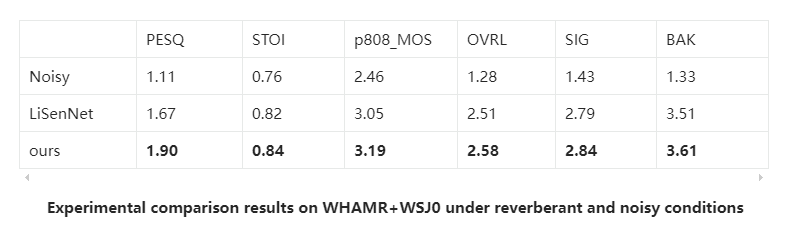

# Anonymous Submission: TF-LiteSE: Lightweight Time-frequency domain sampling model for real-time speech enhancement network.(Anonymous for Review)

📄 Abstract

> Recently, deep learning-based speech enhancement methods have made significant progress in accurately recovering ideal clear speech components from noisy signals. However, edge devices such as mobile and IoT terminals are often constrained by computation, memory, and power consumption, rendering the deployment of large-scale deep neural networks impractical. To address this challenge, we propose TF-LiteSE, a lightweight time-frequency domain speech enhancement network specifically designed for real-time edge deployment. Our design1 integrates a global time-frequency downsampling module followed by a dual-path LinearFormer time-frequency module, which work together to capture long-term temporal dependencies while preserving fine-grained low-frequency details. With only 36K parameters, our model achieves a PESQ score of 3.21 on the VoiceBank+DEMAND dataset and a real-time factor (RTF) of 0.018, demonstrating its practicality in resource constrained environments.
---
⚠️Notice
> This code is released as part of an anonymous submission to a peer-reviewed conference. Author and affiliation information has been removed for double-blind review.
---

🚀 Overview

TF-LiteSE consists of:
- We propose a unified ultra-lightweight time–frequency modeling framework that decouples frequency compression and long-range temporal modeling, enabling global context learning under a strict 36K-parameter constraint.
- We introduce a one-step complex residual phase correction mechanism that compensates for phase ambiguity introduced by aggressive frequency downsampling, avoiding iterative refinement and preserving real-time efficiency.
- We demonstrate that, under extreme parameter constraints, the proposed framework establishes a new performance–efficiency frontier on VoiceBank+DEMAND and low-SNR WSJ0+ESC50 datasets.

---

📦 Installation

Create a virtual environment and activate it:

```bash
git clone https://anonymous.4open.science/r/TF-LiteSE.git
cd repo
conda create -n se python=3.7
conda activate se
pip install -r requirements.txt
```

📥 Data preparation

Download and extract the VoiceBank+DEMAND dataset. Resample all wav files to 16kHz, and move the [clean and noisy wavs](https://datashare.ed.ac.uk/handle/10283/1942) to /Datasets/wavs_clean and /Datasets/wavs_noisy, the test wavs to /Datasets/test_clean and /Datasets/test_noisy. 

Respectively. You can also directly download the downsampled [16kHz dataset](https://drive.google.com/drive/folders/19I_thf6F396y5gZxLTxYIojZXC0Ywm8l)(⚠️notice: Using this requires manually selecting two speakers as the test set.)


🏋️ Training
Before training, edit the configuration file ./config.yaml for your experiment.

Then run:

```bash
python train.py --config ./config.yaml
```
Training logs and checkpoints will be saved under /log.

📄 Result

<!--  -->


🎧 Inference
```bash
python test.py --config ./config.yaml --ckpt_path path/to/checkpoint.ckpt --save_enhanced path/to/savedir
```

🧠 Model Architecture
Our model is composed of three main parts:

📁 Project Structure
```
├── Datasets/             # VoiceBank+DEMAND dataset
├── models/               # Model architecture definitions
│   └── discriminator/    (Optional) Used for discriminator loss
│   └── DP/               # Differentiable PESQ loss
│   └── lts/               # Our model
│   └── model.py
├── log/                  # Train log
├── result/               # Inference result
├── train.py              # Training entry point
├── test.py               # Evaluation script
├── config.yaml           # Main configuration
├── data_module.py        # Dataset loading and preprocessing
├── requirements.txt
└── README.md
```
🔊Samples
<!DOCTYPE html>
<html lang="en">
<body>
  <h2>Voice Bank + DEMAND</h2>
  <table>
    <thead>
      <tr>
        <th>Sample</th>
        <th>Noisy</th>
        <th>Ours</th>
        <th>LiSenNet</th>
        <th>Clean</th>
      </tr>
    </thead>
    <tbody>
      <!-- 第一行示例 -->
      <tr>
        <td>p232_011</td>
        <td><audio controls src="sample/noisy/p232_011.wav"></audio></td>
        <td><audio controls src="sample/enhance/p232_011.wav"></audio></td>
        <td><audio controls src="sample/LiSenNet/p232_011.wav"></audio></td>
        <td><audio controls src="sample/clean/p232_011.wav"></audio></td>
      </tr>
      <tr>
        <td>p232_013</td>
        <td><audio controls src="sample/noisy/p232_013.wav"></audio></td>
        <td><audio controls src="sample/enhance/p232_013.wav"></audio></td>
        <td><audio controls src="sample/LiSenNet/p232_013.wav"></audio></td>
        <td><audio controls src="sample/clean/p232_013.wav"></audio></td>
      </tr>
      <tr>
        <td>p232_031</td>
        <td><audio controls src="sample/noisy/p232_031.wav"></audio></td>
        <td><audio controls src="sample/enhance/p232_031.wav"></audio></td>
        <td><audio controls src="sample/LiSenNet/p232_031.wav"></audio></td>
        <td><audio controls src="sample/clean/p232_031.wav"></audio></td>
      </tr>
      <tr>
        <td>p232_046</td>
        <td><audio controls src="sample/noisy/p232_046.wav"></audio></td>
        <td><audio controls src="sample/enhance/p232_046.wav"></audio></td>
        <td><audio controls src="sample/LiSenNet/p232_046.wav"></audio></td>
        <td><audio controls src="sample/clean/p232_046.wav"></audio></td>
      </tr>
      <tr>
        <td>p232_062</td>
        <td><audio controls src="sample/noisy/p232_062.wav"></audio></td>
        <td><audio controls src="sample/enhance/p232_062.wav"></audio></td>
        <td><audio controls src="sample/LiSenNet/p232_062.wav"></audio></td>
        <td><audio controls src="sample/clean/p232_062.wav"></audio></td>
      </tr>
      <tr>
        <td>p257_007</td>
        <td><audio controls src="sample/noisy/p257_007.wav"></audio></td>
        <td><audio controls src="sample/enhance/p257_007.wav"></audio></td>
        <td><audio controls src="sample/LiSenNet/p257_007.wav"></audio></td>
        <td><audio controls src="sample/clean/p257_007.wav"></audio></td>
      </tr>
      <tr>
        <td>p257_038</td>
        <td><audio controls src="sample/noisy/p257_038.wav"></audio></td>
        <td><audio controls src="sample/enhance/p257_038.wav"></audio></td>
        <td><audio controls src="sample/LiSenNet/p257_038.wav"></audio></td>
        <td><audio controls src="sample/clean/p257_038.wav"></audio></td>
      </tr>
      <tr>
        <td>p257_073</td>
        <td><audio controls src="sample/noisy/p257_073.wav"></audio></td>
        <td><audio controls src="sample/enhance/p257_073.wav"></audio></td>
        <td><audio controls src="sample/LiSenNet/p257_073.wav"></audio></td>
        <td><audio controls src="sample/clean/p257_073.wav"></audio></td>
      </tr>
      <tr>
        <td>p257_147</td>
        <td><audio controls src="sample/noisy/p257_147.wav"></audio></td>
        <td><audio controls src="sample/enhance/p257_147.wav"></audio></td>
        <td><audio controls src="sample/LiSenNet/p257_147.wav"></audio></td>
        <td><audio controls src="sample/clean/p257_147.wav"></audio></td>
      </tr>
      <tr>
        <td>p257_266</td>
        <td><audio controls src="sample/noisy/p257_266.wav"></audio></td>
        <td><audio controls src="sample/enhance/p257_266.wav"></audio></td>
        <td><audio controls src="sample/LiSenNet/p257_266.wav"></audio></td>
        <td><audio controls src="sample/clean/p257_266.wav"></audio></td>
      </tr>
      <tr>
        <td>p257_290</td>
        <td><audio controls src="sample/noisy/p257_290.wav"></audio></td>
        <td><audio controls src="sample/enhance/p257_290.wav"></audio></td>
        <td><audio controls src="sample/LiSenNet/p257_290.wav"></audio></td>
        <td><audio controls src="sample/clean/p257_290.wav"></audio></td>
      </tr>
      <tr>
        <td>p257_316</td>
        <td><audio controls src="sample/noisy/p257_316.wav"></audio></td>
        <td><audio controls src="sample/enhance/p257_316.wav"></audio></td>
        <td><audio controls src="sample/LiSenNet/p257_316.wav"></audio></td>
        <td><audio controls src="sample/clean/p257_316.wav"></audio></td>
      </tr>
      <!-- … -->
    </tbody>
  </table>

</body>
</html>


📄 License<br>
This project is released for academic use only.

💬 Contact<br>
Please reach out through the submission item if you have questions or suggestions.

Reference<br>
[LiSenNet](https://github.com/hyyan2k/LiSenNet)、[LinearFormer](https://github.com/lucidrains/linear-attention-transformer)、[torch-pesq](https://github.com/audiolabs/torch-pesq)
